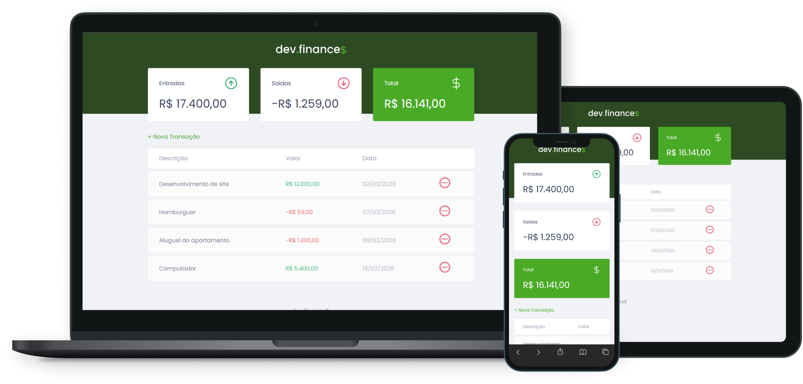

<p align="center">
  
</p>

<p align="center">
  <a href="#-projeto">Projeto</a>&nbsp;&nbsp;&nbsp;|&nbsp;&nbsp;&nbsp;
  <a href="#-funcionalidades">Funcionalidades</a>&nbsp;&nbsp;&nbsp;|&nbsp;&nbsp;&nbsp;
  <a href="#-tecnologias-utilizadas">Tecnologias Utilizadas</a>&nbsp;&nbsp;&nbsp;|&nbsp;&nbsp;&nbsp;
  <a href="#-estrutura-do-projeto">Estrutura do Projeto</a>&nbsp;&nbsp;&nbsp;|&nbsp;&nbsp;&nbsp;
  <a href="#-acesse-o-site">Acesse o site</a>&nbsp;&nbsp;&nbsp;|&nbsp;&nbsp;&nbsp;
  <a href="#-como-visualizar-localmente">Como Visualizar Localmente</a>&nbsp;&nbsp;&nbsp;|&nbsp;&nbsp;&nbsp;
  <a href="#-licença">Licença</a>
</p>

<p align="center">
 
 
 
</p>

<p align="center"><h1 align="center">DevFinance💰</h1></p>

## 💻 Projeto

Uma aplicação web simples para **controle financeiro pessoal**, permitindo registrar receitas e despesas, visualizar saldo e gerenciar transações.

O objetivo do projeto é praticar **JavaScript puro**, manipulação do **DOM** e persistência de dados utilizando **LocalStorage**.

## ✨ Funcionalidades

➕ Adicionar novas transações  
➖ Remover transações  
💰 Visualizar saldo total  
📊 Cálculo automático de **entradas e saídas**  
💾 Armazenamento de dados no navegador com **LocalStorage**  
📱 Interface simples e intuitiva

## 🪛 Tecnologias Utilizadas

Este projeto foi desenvolvido com as seguintes tecnologias:

- HTML5
- CSS3
- JavaScript (ES6+)
- LocalStorage API

## 📁 Estrutura do Projeto

```bash
/
├── assets
├── index.html
├── style.css
└── script.js
```

## 🌎 Acesse o site

Para visualizar o projeto [clique aqui]( https://gqueico.github.io/devfinance/)

## 🚀 Como Visualizar Localmente

  Primeiro faça o clone do repositório:

  ```bash
  git clone https://github.com/gqueico/devfinance.git
  ```
  Acesse a pasta do projeto:
  
  ```bash
  cd devfinance
  ```

  Pronto! Agora abra o arquivo `index.html` no seu navegador

## 📝 Licença

Esse projeto está sob a licença `MIT`. Veja o arquivo [LICENSE](LICENSE) para mais detalhes.